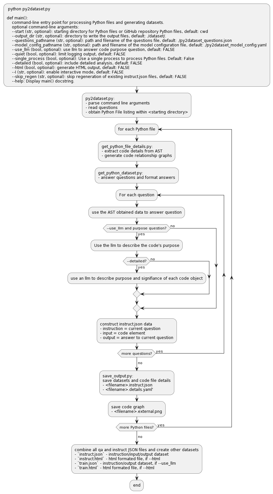

# py2dataset - Python to Dataset

py2dataset analyzes source code to generate structured datasets describing code content and behavior. It extracts information from Python files and converts it into JSON-formatted datasets. These datasets can help users understand Python software or train AI systems.

First, py2dataset obtains the questions from the 'questions.json' file and identifies all of Python files within the provided directory. 

Next, py2dataset parses each Python file using the **Abstract Syntax Tree (AST)** and **visitor design pattern** to build a representation of the code structure, functions, classes, methods and variables.

py2dataset then generates the information for the output datasets including question-answer pairs and instruction-input-output triplets using code snippets as context. The datasets answer the 'questions.json' questions about the Python file characteristics. Optionally, py2dataset invokes a **language model** to generate responses to questions about the purpose of each file, function, class, method, and variable.

For each Python code file analyzed, py2dataset outputs a `<filename>.qa.json`, `<filename>.instruct.json`, and a `<filename>.details.yaml` containing the AST analysis to the local `'./dataset'` directory or a specified output directory. The software then consolidates all of the datasets together to produce a final `'qa.json'` and `'instruct.json'` that contains the entire dataset contents. Optionally, py2dataset also creates **relationship graphs** between functions and classes as image files.

With its AST parser, visitor pattern and configurable questions, py2dataset flexibly and extensibly analyzes source code to generate descriptive datasets. Its modular architecture and multiple formats support diverse use cases for understanding and learning Python code.



## Overview

The main script is `py2dataset.py`. It analyzes Python source code files in a given directory using the `get_python_file_details.py` module. The `get_python_json.py` module is used to generate the question-answer pairs and instructions, using a large language model if enabled by the `--use_llm` option. The large language model is used to answer the questions related to the purpose of the file, functions, classes and variables.

## Installation

You can install py2dataset using pip:

    pip install py2dataset

**Imported Libraries:** os, argparse, logging, pathlib, yaml

## Usage

### Command Line Interface

**Example usage:**

    python -m py2dataset ../my_python_code --use_llm --output_dir ./dataset --graph --model_config ./model_config.yaml
    
**Positional arguments:**
- `directory`: The directory containing the Python files to analyze.

Without any arguments, the script will prompt for a directory and write output to `./datasets`.

**Optional arguments:**
- `-h, --help`: Show the help message and exit.
- `--use_llm`: Use large language model for question answering.
- `--quiet`: Suppress all info logging messages.
- `--output_dir OUTPUT_DIR`: Output directory to store generated files, default is .\datasets in the current working directory
- `--graph`: Generate code relationship graphs.
- `--model_config` - Specify a model configuration file, default is model_config.yaml

### Python API

You can also use py2dataset directly in your Python code:

    ```python
    from py2dataset import py2dataset
    # Create datasets for python code at "../my_python_code_directory"
    py2dataset("../my_python_code_directory", use_llm=True, graph=True, output_dir="./dataset")
    ```
This will have the same effect as the command line example above.
 
## Questions for datasets

The following questions are answered by parsing the AST:
- Dependencies of file: ({filename})?,
- Structural graph of the relationships between the functions and classes defined in file: ({filename})?
- Structural graph of the relationships between the functions and classes defined and used in file: ({filename})?
- Functions in file: ({filename})?
- Classes in file: ({filename})?
- Control Flow in file: ({filename})?
- Inputs to function: ({function_name}) in file: ({filename})?
- Docstring of function: ({function_name}) in file: ({filename})?
- Calls in function: ({function_name}) in file: ({filename})?
- Variables in function: ({function_name}) in file: ({filename})?
- Returns from function: ({function_name}) in file: ({filename})?
- Methods in class: ({class_name}) in file: ({filename})?
- Docstring of class: ({class_name}) in file: ({filename})?
- Attributes of class: ({class_name}) in file: ({filename})?
- Variables in class: ({class_name}) in file: ({filename})?
- Inheritance of class: ({class_name}) in file: ({filename})?
- Inputs to method: ({method_name}) in class: ({class_name}) in file: ({filename})?
- Docstring of method: ({method_name}) in class: ({class_name}) in file: ({filename})?
- Calls in method: ({method_name}) in class: ({class_name}) in file: ({filename})?
- Returns from method: ({method_name}) in class: ({class_name}) in file: ({filename})?

The following questions are answered using a language model if --use_llm: 
- Purpose of file: ({filename})?
- Purpose of function: ({function_name}) in file: ({filename})?
- Purpose of class: ({class_name}) in file: ({filename})?
- Purpose of method: ({method_name}) in class: ({class_name}) in file: ({filename})?
- Purpose of variable: ({function_variable}) in function: ({function_name}) in file: ({filename})?
- Purpose of variable: ({class_variable}) in class: ({class_name}) in file: ({filename})?

## Code Structure

- `py2dataset.py` - Main script
- `get_python_file_details.py` - Extracts details from Python files using AST
- `get_python_json.py` - Generates question-answer pairs and instructions
- `questions.json` - Standard questions for Python files, functions, classes
- `model_config.yaml` - Configuration for large language model

## Output

The script generates the following output:

- `<filename>.details.yaml` - Python file details YAML file
- `<filename>.qa.json` - Question-answer pairs JSON file
- `<filename>.instruct.json` - Instructions JSON file
- `qa.json` - Combined question-answer JSON file
- `instruct.json` - Combined instructions JSON file
- Code relationship graphs (optional)

## Requirements

- Python >= 3.8
- **networkx** module (optional for graphs)
- **ctransformers** library for large language model support
- **yaml** library for configuration and output files
